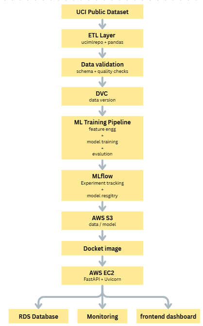

# Souel Bike Rental Prediction

## End-to-End Data Science Project

An end-to-end data science project invloves Machine Learning, MLOps, DevOps and AWS.

> Machine Learining | MLOps | AWS | DevOps |

---

## Table of Contents

- [Overview](#overview)
- [Project Objectives](#project-objectives)
- [Business and Technical Context](#business-and-technical-context)
- [Key Conclusions](#key-conclusions)
- [Project Summary](#project-summary)
- [System Architecture](#system-architecture)
- [Repository Structure](#repository-structure)
- [Dataset](#dataset)
- [Data Collection](#data-collection)
- [ETL and Data Validation](#etl-and-data-validation)
- [Data Version Control](#data-version-control)
- [Exploratory Data Analysis](#exploratory-data-analysis)
- [Feature Engineering](#feature-engineering)
- [Model Development](#model-development)
- [Experiment Tracking](#experiment-tracking)
- [Model Selection](#model-selection)
- [Model Serialization](#model-serialization)
- [Application and API](#application-and-api)
- [Streamlit Dashboard](#streamlit-dashboard)
- [Storage and Metadata](#storage-and-metadata)
- [Containerization](#containerization)
- [Workflow Orchestration](#workflow-orchestration)
- [Cloud Deployment](#cloud-deployment)
- [CI/CD](#cicd)
- [Monitoring and Observability](#monitoring-and-observability)
- [Security and Governance](#security-and-governance)
- [Performance](#performance)
- [Limitations](#limitations)
- [Future Improvements](#future-improvements)
- [Reproducibility](#reproducibility)
- [Installation](#installation)
- [Configuration](#configuration)
- [Usage](#usage)
- [Testing](#testing)
- [Troubleshooting](#troubleshooting)
- [Contributing](#contributing)
- [License](#license)
- [Contact](#contact)
- [Acknowledgements](#acknowledgements)

---

## Overview

### Project Name

Souel Bike Rental Prediction end-to-end data science project

### Project Type

Regression

### Domain

Data Science

### Project Status

Active (in progress)

### Primary Outcome

- Learn AWS services (S3 bucket, IAM, Database, EC2)
- Learn MLOps (dataset versioning, experiment tracking, model registration)
- Learn Devops (source code versioning, CI/CD pipeline, containerization)
- Learn ML (model training, model testing, hyperparameter tuning, serialization)

### Intended Audience

- IT or CSE Students
- Data Science beginners / learners

---

## Project Objectives

### Primary Objective

- Learn to build end-to-end data science projects.
- Learning and practicing MLOps, Devops and AWS 
- Integrating AWS services in project.

### Success Criteria

- ETL (extract-transform-load)
- EDA (Exploratory Data Analysis)
- Data validation
- Model training
- Experiment Tracking and model serialization
- Data version control using dvc
- containerziation
- CI / CD
- Functional APP
- Database srorage

---

## Project Summary

### End-to-End Workflow

```
Public Dataset
    |
ETL Pipeline
    |
Data Validation
    |
DVC Versioning
    |
EDA + Feature Engg
    |
Model Trainingg
    |
Mlflow tracking 
    |
Model Resgitry
    |
AWS S3 storage
    |
Containerization
    |
Dashboard & frontend
```

### Technology Summary

| Category | Technology | Purpose | Version |
|---|---|---|---|
| Language | Python | primary language | 3.12 |
| Data Processing | pandas | to process and transform csv file | 2.3.3 |
| Machine Learning | scikit-learn, joblib | model training framework and serialization| 1.7.2, 1.5.3 |
| Experiment Tracking | mlflow | track each model training and evaluation | 3.11.2 |
| Data Versioning | dvc | to track each version of datasets | 3.67.1 |
| API | FastAPI | backend and RESTAPI | 0.109.2 |
| Dashboard | CSS, HTML, JS | frontend | --- |
| Orchestration | astro cli | Apache Airflow orchestratioin | 1.45.0 |
| Containerization | docker | packaging project | 29.1.3 |
| Cloud | AWS | computing and storage | (aws cli) 2.36.49 |
| CI/CD | Github Actions | building CI / CD pipelines | --- |
| Database | AWS RDS | prediction and output storage | --- |

---

## System Architecture

### Architecture Diagram



### Pipeline Diagram


### Deployment Diagram


### Architecture Overview

[ARCHITECTURE_OVERVIEW_PLACEHOLDER]

### Data Flow

[DATA_FLOW_DESCRIPTION_PLACEHOLDER]

### Component Responsibilities

| Component | Responsibility | Input | Output | Location |
|---|---|---|---|---|
| Data Collection | [RESPONSIBILITY] | [INPUT] | [OUTPUT] | [PATH_OR_SERVICE] |
| ETL | [RESPONSIBILITY] | [INPUT] | [OUTPUT] | [PATH_OR_SERVICE] |
| Validation | [RESPONSIBILITY] | [INPUT] | [OUTPUT] | [PATH_OR_SERVICE] |
| Feature Engineering | [RESPONSIBILITY] | [INPUT] | [OUTPUT] | [PATH_OR_SERVICE] |
| Training | [RESPONSIBILITY] | [INPUT] | [OUTPUT] | [PATH_OR_SERVICE] |
| Inference API | [RESPONSIBILITY] | [INPUT] | [OUTPUT] | [PATH_OR_SERVICE] |
| Dashboard | [RESPONSIBILITY] | [INPUT] | [OUTPUT] | [PATH_OR_SERVICE] |
| Orchestration | [RESPONSIBILITY] | [INPUT] | [OUTPUT] | [PATH_OR_SERVICE] |

---

## Repository Structure

```text
BikeRentalPrediction/
│
├── .github/
│   └── workflows/
│       ├── ci.yml
│       └── cd.yml
│
├── dags/
│   ├── etl_pipeline.py
│   ├── training_pipeline.py
│   └── monitoring_pipeline.py
│
├── data/
│   ├── raw/
│   ├── processed/
|
│── assets/
│   ├── architecture.png
│   ├── docker.png
|   ├── dvc.png
|   ├── mlfow.png
│
├── src/
│   ├── __init__.py
│   │
│   ├── ingestion/
│   │   ├── __init__.py
│   │   └── extract.py
│   │
│   ├── preprocessing/
│   │   ├── __init__.py
│   │   └── transform.py
│   │
│   ├── validation/
│   │   ├── __init__.py
│   │   └── validate.py
│   │
│   ├── features/
│   │   ├── __init__.py
│   │   └── engineering.py
│   │
│   ├── training/
│   │   ├── train.py
│   │   └── evaluate.py
│   │
│   ├── inference/
│   │   └── predict.py
│   │
│   ├── aws/
│   │   ├── s3.py
│   │   └── database.py
│   │
│   └── monitoring/
│   |    └── monitor.py
│   |
|   |── logger.py
│   └── excpetion.py
|   
│   
├── models/
│   └── my_model.joblib
│
├── notebooks/
│   ├── 01_eda.ipynb
│   └── 02_model_experiments.ipynb
│
├── tests/
│   ├── test_ingestion.py
│   ├── test_validation.py
│   ├── test_features.py
│   ├── test_model.py
│   └── test_api.py
│
├── app/
│   └── templates/
|   |       ├── index.html
│   ├── scripts/
|   |       ├── index.js
|   ├── styles/
|   |       ├── index.css
|   ├── main.py
|
|
├── configs/
│   └── model_config.yml
│
├── reports/
│   └── figures/
│
├── Dockerfile
├── requirements.txt
├── pyproject.toml
├── dvc.yaml
├── dvc.lock
├── .gitignore
├── .python-version
├── .dockerignore
├── .dvcignore
├── README.md
```

---

## Dataset

### Dataset Name

Seoul Bike Sharing Demand

### Dataset Source

[DATASET_SOURCE_NAME](https://archive.ics.uci.edu/dataset/560/seoul+bike+sharing+demand)

### Dataset License

[DATASET_LICENSE](https://creativecommons.org/licenses/by/4.0/legalcode)

### Data Dictionary

[DATA_DICTIONARY_LINK](https://archive.ics.uci.edu/dataset/560/seoul+bike+sharing+demand)

### Data Dimensions

| Split | Rows | Columns | Date Range | Storage Location |
|---|---:|---:|---|---|
| Raw | 13 | 8760 | [VALUE] | [S3_OR_LOCAL_PATH] |
| Processed | [VALUE] | [VALUE] | [VALUE] | [S3_OR_LOCAL_PATH] |
| Train | [VALUE] | [VALUE] | [VALUE] | [S3_OR_LOCAL_PATH] |
| Validation | [VALUE] | [VALUE] | [VALUE] | [S3_OR_LOCAL_PATH] |
| Test | [VALUE] | [VALUE] | [VALUE] | [S3_OR_LOCAL_PATH] |

### Target Variable

- **Target:** Rented Bike Count
- **Target Type:** Integer
- **Target Definition:** Number of bikes rented

---

## Data Collection

### Collection Method

using package `ucimlrepo`

### Source URL

https://archive.ics.uci.edu/dataset/560/seoul+bike+sharing+demand


### Collection Script or Pipeline

[COLLECTION_SCRIPT_PATH]

### Raw Data Location

[S3_RAW_DATA_URL]

### Data Collection Notes

[DATA_COLLECTION_NOTES_PLACEHOLDER]

---

## ETL and Data Validation

### Extract

[EXTRACT_PROCESS_PLACEHOLDER]

### Transform

[TRANSFORM_PROCESS_PLACEHOLDER]

### Load

[LOAD_PROCESS_PLACEHOLDER]

### Validation Framework

[VALIDATION_FRAMEWORK]

### Validation Rules

- [VALIDATION_RULE_1]
- [VALIDATION_RULE_2]
- [VALIDATION_RULE_3]

### Data Quality Results

| Check | Expected | Observed | Status |
|---|---|---|---|
| Missing Values | [EXPECTED] | [OBSERVED] | [PASS_OR_FAIL] |
| Duplicate Rows | [EXPECTED] | [OBSERVED] | [PASS_OR_FAIL] |
| Schema | [EXPECTED] | [OBSERVED] | [PASS_OR_FAIL] |
| Data Types | [EXPECTED] | [OBSERVED] | [PASS_OR_FAIL] |
| Range Constraints | [EXPECTED] | [OBSERVED] | [PASS_OR_FAIL] |
| Referential Integrity | [EXPECTED] | [OBSERVED] | [PASS_OR_FAIL] |

### Validation Report

[VALIDATION_REPORT_LINK]([VALIDATION_REPORT_URL])

---

## Data Version Control

### DVC Remote

[DVC_REMOTE_PROVIDER]

### DVC Storage Location

[DVC_REMOTE_URL]

### Dataset Version

[DVC_DATASET_VERSION]

### Reproduce Data Pipeline

[DVC_REPRO_COMMAND]

### Data Lineage

[DATA_LINEAGE_LINK]([DATA_LINEAGE_URL])

---

## Exploratory Data Analysis

### EDA Objectives

- [EDA_OBJECTIVE_1]
- [EDA_OBJECTIVE_2]
- [EDA_OBJECTIVE_3]

### Data Quality Insights

[DATA_QUALITY_INSIGHTS_PLACEHOLDER]

### Distribution Analysis


### Correlation Analysis


### Target Analysis


### Key EDA Findings

- [EDA_FINDING_1]
- [EDA_FINDING_2]
- [EDA_FINDING_3]

### EDA Notebook

[EDA_NOTEBOOK_LINK]([EDA_NOTEBOOK_URL])

---

## Feature Engineering

### Feature Engineering Strategy

[FEATURE_ENGINEERING_STRATEGY_PLACEHOLDER]

### Created Features

| Feature | Description | Type | Source | Transformation |
|---|---|---|---|---|
| [FEATURE_NAME] | [DESCRIPTION] | [TYPE] | [SOURCE] | [TRANSFORMATION] |
| [FEATURE_NAME] | [DESCRIPTION] | [TYPE] | [SOURCE] | [TRANSFORMATION] |

### Encoding and Scaling

[ENCODING_AND_SCALING_PLACEHOLDER]

### Feature Selection

[FEATURE_SELECTION_PLACEHOLDER]

### Data Leakage Controls

[DATA_LEAKAGE_CONTROLS_PLACEHOLDER]

### Feature Pipeline

[FEATURE_PIPELINE_PATH]

---

## Model Development

### Problem Formulation

[PROBLEM_FORMULATION_PLACEHOLDER]

### Data Splitting Strategy

[DATA_SPLITTING_STRATEGY_PLACEHOLDER]

### Baseline Model

- **Model:** [BASELINE_MODEL]
- **Metric:** [BASELINE_METRIC]
- **Score:** [BASELINE_SCORE]

### Candidate Models

| Model | Library | Hyperparameter Strategy | Training Status |
|---|---|---|---|
| [MODEL_NAME] | [LIBRARY] | [STRATEGY] | [STATUS] |
| [MODEL_NAME] | [LIBRARY] | [STRATEGY] | [STATUS] |
| [MODEL_NAME] | [LIBRARY] | [STRATEGY] | [STATUS] |

### Evaluation Metrics

| Metric | Definition | Primary or Secondary | Direction |
|---|---|---|---|
| [METRIC_NAME] | [DEFINITION] | [PRIMARY_OR_SECONDARY] | [MAXIMIZE_OR_MINIMIZE] |
| [METRIC_NAME] | [DEFINITION] | [PRIMARY_OR_SECONDARY] | [MAXIMIZE_OR_MINIMIZE] |

### Model Performance

| Rank | Model | Train Score | Validation Score | Test Score | Inference Latency | Status |
|---:|---|---:|---:|---:|---:|---|
| 1 | [MODEL_NAME] | [VALUE] | [VALUE] | [VALUE] | [VALUE] | [SELECTED_OR_REJECTED] |
| 2 | [MODEL_NAME] | [VALUE] | [VALUE] | [VALUE] | [VALUE] | [SELECTED_OR_REJECTED] |
| 3 | [MODEL_NAME] | [VALUE] | [VALUE] | [VALUE] | [VALUE] | [SELECTED_OR_REJECTED] |

### Training Configuration

[TRAINING_CONFIGURATION_LINK]([TRAINING_CONFIGURATION_URL])

---

## Experiment Tracking

### MLflow Tracking Server

[MLFLOW_TRACKING_SERVER_URL]

### Experiment Name

[MLFLOW_EXPERIMENT_NAME]

### Run Artifacts

[MLFLOW_ARTIFACT_STORE_URL]

### Tracked Parameters

- [PARAMETER_1]
- [PARAMETER_2]
- [PARAMETER_3]

### Tracked Metrics

- [METRIC_1]
- [METRIC_2]
- [METRIC_3]

### Experiment Comparison

[MLFLOW_COMPARISON_LINK]([MLFLOW_COMPARISON_URL])

---

## Model Selection

### Selected Model

[SELECTED_MODEL_NAME]

### Selection Criteria

[MODEL_SELECTION_CRITERIA_PLACEHOLDER]

### Selection Rationale

[MODEL_SELECTION_RATIONALE_PLACEHOLDER]

### Model Card

[MODEL_CARD_LINK]([MODEL_CARD_URL])

### Model Registry Entry

[MODEL_REGISTRY_LINK]([MODEL_REGISTRY_URL])

---

## Model Serialization

### Model Artifact

[MODEL_ARTIFACT_NAME]

### Serialization Format

[JOBLIB_OR_PICKLE_OR_ONNX_OR_SAFETENSORS_OR_OTHER]

### Model Version

[MODEL_VERSION]

### Model Storage Location

[S3_MODEL_ARTIFACT_URL]

### Preprocessing Artifact

[PREPROCESSING_ARTIFACT_PATH_OR_URL]

### Model Checksum

[MODEL_CHECKSUM]

---

## Application and API

### API Framework

[FASTAPI_VERSION]

### Server

[UVICORN_VERSION]

### API Base URL

[API_BASE_URL]

### API Documentation

- [Swagger UI]([SWAGGER_URL])
- [ReDoc]([REDOC_URL])
- [OpenAPI Schema]([OPENAPI_SCHEMA_URL])

### Endpoints

| Method | Endpoint | Purpose | Request Schema | Response Schema |
|---|---|---|---|---|
| `GET` | `/health` | [PURPOSE] | [SCHEMA] | [SCHEMA] |
| `GET` | `/metadata` | [PURPOSE] | [SCHEMA] | [SCHEMA] |
| `POST` | `/predict` | [PURPOSE] | [SCHEMA] | [SCHEMA] |
| `GET` | `/history` | [PURPOSE] | [SCHEMA] | [SCHEMA] |

### Example Request

[API_REQUEST_EXAMPLE_PLACEHOLDER]

### Example Response

[API_RESPONSE_EXAMPLE_PLACEHOLDER]

### API Authentication

[API_AUTHENTICATION_METHOD]

---

## Streamlit Dashboard

### Dashboard URL

[STREAMLIT_APP_URL]

### Dashboard Purpose

[DASHBOARD_PURPOSE_PLACEHOLDER]

### Dashboard Screenshots


### Dashboard Features

- [DASHBOARD_FEATURE_1]
- [DASHBOARD_FEATURE_2]
- [DASHBOARD_FEATURE_3]

---

## Storage and Metadata

### AWS S3

- **Bucket:** [S3_BUCKET_NAME]
- **Region:** [AWS_REGION]
- **Raw Data Path:** [S3_RAW_DATA_PATH]
- **Processed Data Path:** [S3_PROCESSED_DATA_PATH]
- **Model Path:** [S3_MODEL_PATH]
- **Artifact Path:** [S3_ARTIFACT_PATH]

### AWS Database

- **Service:** [RDS_OR_DYNAMODB_OR_AURORA_OR_OTHER]
- **Database Name:** [DATABASE_NAME]
- **Schema or Table:** [SCHEMA_OR_TABLE]
- **Metadata Purpose:** [METADATA_PURPOSE]

### Prediction History

[PREDICTION_HISTORY_SCHEMA_PLACEHOLDER]

### Retention Policy

[RETENTION_POLICY_PLACEHOLDER]

---

## Containerization

### Docker Image

[DOCKER_IMAGE_URL]

### Dockerfile

[DOCKERFILE_PATH]

### Build Command

[DOCKER_BUILD_COMMAND]

### Run Command

[DOCKER_RUN_COMMAND]

### Docker Compose

[DOCKER_COMPOSE_PATH]

### Container Services

| Service | Port | Purpose |
|---|---:|---|
| [SERVICE_NAME] | [PORT] | [PURPOSE] |
| [SERVICE_NAME] | [PORT] | [PURPOSE] |
| [SERVICE_NAME] | [PORT] | [PURPOSE] |

---

## Workflow Orchestration

### Orchestrator

[ASTRO_OR_AIRFLOW_VERSION]

### DAG Name

[DAG_NAME]

### DAG URL

[AIRFLOW_DAG_URL]

### Pipeline Tasks

1. [TASK_1]
2. [TASK_2]
3. [TASK_3]
4. [TASK_4]
5. [TASK_5]

### Schedule

[PIPELINE_SCHEDULE]

### Dependencies

[PIPELINE_DEPENDENCY_DESCRIPTION]

### Pipeline Visualization


---

## Cloud Deployment

### Cloud Provider

[AWS]

### Deployment Environment

[ENVIRONMENT_NAME]

### EC2 Instance

- **Instance Type:** [EC2_INSTANCE_TYPE]
- **Operating System:** [OPERATING_SYSTEM]
- **Region:** [AWS_REGION]
- **Availability Zone:** [AVAILABILITY_ZONE]
- **Public or Private:** [NETWORK_VISIBILITY]

### Deployment URL

[DEPLOYMENT_URL]

### Infrastructure Configuration

[INFRASTRUCTURE_CONFIGURATION_LINK]([INFRASTRUCTURE_CONFIGURATION_URL])

### Deployment Steps

[DEPLOYMENT_STEPS_REFERENCE]([DEPLOYMENT_DOCUMENTATION_URL])

---

## CI/CD

### CI/CD Platform

[GitHub Actions]

### Workflow Files

- [CI_WORKFLOW_PATH]
- [CD_WORKFLOW_PATH]
- [DATA_PIPELINE_WORKFLOW_PATH]

### Continuous Integration Checks

- [CI_CHECK_1]
- [CI_CHECK_2]
- [CI_CHECK_3]

### Continuous Deployment Steps

- [CD_STEP_1]
- [CD_STEP_2]
- [CD_STEP_3]

### Secrets and Variables

[SECRETS_AND_VARIABLES_DOCUMENTATION_LINK]([SECRETS_DOCUMENTATION_URL])

### Deployment Status

[]([DEPLOYMENT_STATUS_URL])

---

## Monitoring and Observability

### Application Monitoring

[APPLICATION_MONITORING_TOOL]

### Model Monitoring

[MODEL_MONITORING_TOOL]

### Data Drift Monitoring

[DATA_DRIFT_MONITORING_APPROACH]

### Concept Drift Monitoring

[CONCEPT_DRIFT_MONITORING_APPROACH]

### Logging

[LOGGING_PLATFORM]

### Alerting

[ALERTING_PLATFORM]

### Health Checks

[HEALTH_CHECK_URL]

---

## Security and Governance

### Authentication and Authorization

[AUTHENTICATION_AND_AUTHORIZATION_PLACEHOLDER]

### IAM Roles and Policies

[IAM_DOCUMENTATION_LINK]([IAM_DOCUMENTATION_URL])

### Secrets Management

[SECRETS_MANAGEMENT_SERVICE]

### Network Security

[NETWORK_SECURITY_PLACEHOLDER]

### Data Privacy

[DATA_PRIVACY_PLACEHOLDER]

### PII or Sensitive Data Handling

[PII_HANDLING_PLACEHOLDER]

### Governance and Compliance

[COMPLIANCE_REQUIREMENTS]

---

## Performance

### API Performance

| Metric | Target | Observed | Status |
|---|---:|---:|---|
| Response Latency | [TARGET] | [OBSERVED] | [STATUS] |
| Throughput | [TARGET] | [OBSERVED] | [STATUS] |
| Error Rate | [TARGET] | [OBSERVED] | [STATUS] |
| Availability | [TARGET] | [OBSERVED] | [STATUS] |

### Model Performance

[MODEL_PERFORMANCE_SUMMARY_PLACEHOLDER]

### Resource Utilization

[RESOURCE_UTILIZATION_SUMMARY_PLACEHOLDER]

---

## Limitations

- [LIMITATION_1]
- [LIMITATION_2]
- [LIMITATION_3]

### Known Risks

- [KNOWN_RISK_1]
- [KNOWN_RISK_2]
- [KNOWN_RISK_3]

### Out-of-Scope Items

- [OUT_OF_SCOPE_ITEM_1]
- [OUT_OF_SCOPE_ITEM_2]

---

## Future Improvements

- [FUTURE_IMPROVEMENT_1]
- [FUTURE_IMPROVEMENT_2]
- [FUTURE_IMPROVEMENT_3]

### Roadmap

| Priority | Improvement | Owner | Target Date | Status |
|---|---|---|---|---|
| [HIGH_OR_MEDIUM_OR_LOW] | [IMPROVEMENT] | [OWNER] | [DATE] | [STATUS] |
| [HIGH_OR_MEDIUM_OR_LOW] | [IMPROVEMENT] | [OWNER] | [DATE] | [STATUS] |

---

## Reproducibility

### Reproducibility Requirements

- [PYTHON_VERSION]
- [OPERATING_SYSTEM]
- [DEPENDENCY_LOCKFILE]
- [RANDOM_SEED]
- [DATA_VERSION]
- [MODEL_VERSION]

### Reproduction Workflow

[REPRODUCTION_WORKFLOW_PLACEHOLDER]

### Reproduction Reference

[REPRODUCTION_DOCUMENTATION_LINK]([REPRODUCTION_DOCUMENTATION_URL])

---

## Installation

### Prerequisites

- [PREREQUISITE_1]
- [PREREQUISITE_2]
- [PREREQUISITE_3]

### Clone Repository

[REPOSITORY_URL]

### Environment Setup

[ENVIRONMENT_SETUP_REFERENCE]([ENVIRONMENT_SETUP_URL])

### Dependency Installation

[DEPENDENCY_INSTALLATION_REFERENCE]([DEPENDENCY_INSTALLATION_URL])

### DVC Setup

[DVC_SETUP_REFERENCE]([DVC_SETUP_URL])

### AWS Setup

[AWS_SETUP_REFERENCE]([AWS_SETUP_URL])

---

## Configuration

### Environment Variables

| Variable | Description | Required | Example |
|---|---|---|---|
| `[ENV_VARIABLE]` | [DESCRIPTION] | [YES_OR_NO] | `[EXAMPLE]` |
| `[ENV_VARIABLE]` | [DESCRIPTION] | [YES_OR_NO] | `[EXAMPLE]` |
| `[ENV_VARIABLE]` | [DESCRIPTION] | [YES_OR_NO] | `[EXAMPLE]` |

### Configuration Files

- [CONFIG_FILE_1]
- [CONFIG_FILE_2]
- [CONFIG_FILE_3]

### Configuration Reference

[CONFIGURATION_DOCUMENTATION_LINK]([CONFIGURATION_DOCUMENTATION_URL])

---

## Usage

### Run Data Pipeline

[DATA_PIPELINE_COMMAND_OR_REFERENCE]

### Run Training Pipeline

[TRAINING_PIPELINE_COMMAND_OR_REFERENCE]

### Run API Locally

[LOCAL_API_COMMAND_OR_REFERENCE]

### Run Dashboard Locally

[LOCAL_DASHBOARD_COMMAND_OR_REFERENCE]

### Run Complete Stack

[COMPLETE_STACK_COMMAND_OR_REFERENCE]

### Prediction Workflow

[PREDICTION_WORKFLOW_PLACEHOLDER]

---

## Testing

### Test Framework

[TEST_FRAMEWORK]

### Test Categories

- [UNIT_TESTS]
- [INTEGRATION_TESTS]
- [DATA_VALIDATION_TESTS]
- [MODEL_TESTS]
- [API_TESTS]
- [END_TO_END_TESTS]

### Run Tests

[TEST_COMMAND]

### Test Coverage

[]([COVERAGE_URL])

### Test Reports

[TEST_REPORT_LINK]([TEST_REPORT_URL])

---

## Troubleshooting

### [TROUBLESHOOTING_TOPIC_1]

[TROUBLESHOOTING_SOLUTION_1]

### [TROUBLESHOOTING_TOPIC_2]

[TROUBLESHOOTING_SOLUTION_2]

### [TROUBLESHOOTING_TOPIC_3]

[TROUBLESHOOTING_SOLUTION_3]

### Support Reference

[SUPPORT_DOCUMENTATION_LINK]([SUPPORT_DOCUMENTATION_URL])

---

## Contributing

### Contribution Guidelines

[CONTRIBUTION_GUIDELINES_PLACEHOLDER]

### Development Workflow

[DEVELOPMENT_WORKFLOW_PLACEHOLDER]

### Branching Strategy

[BRANCHING_STRATEGY_PLACEHOLDER]

### Pull Request Requirements

- [PULL_REQUEST_REQUIREMENT_1]
- [PULL_REQUEST_REQUIREMENT_2]
- [PULL_REQUEST_REQUIREMENT_3]

### Code of Conduct

[CODE_OF_CONDUCT_LINK]([CODE_OF_CONDUCT_URL])

### Issue Tracker

[ISSUE_TRACKER_LINK]([ISSUE_TRACKER_URL])

---

## License

[LICENSE_NAME]

[LICENSE_TEXT_OR_REFERENCE]

[LICENSE_LINK]([LICENSE_URL])

---

## Contact

### Maintainer

Yash Chillal

### Email

chillalyash2005@gmail.com

### LinkedIn

https://www.linkedin.com/in/yash-chillal-9a069a303/

### Project Repository

https://github.com/Yashuu05/Bike-Rental-Prediction

### Documentation

[DOCUMENTATION_URL]

---

## Acknowledgements

 


### Data Source Attribution

[UC Irvine Machine Learning Repository](https://archive.ics.uci.edu/dataset/560/seoul+bike+sharing+demand)

### Technology References

- [scikit-learn](https://scikit-learn.org/stable/user_guide.html)
- [pandas](https://pandas.pydata.org/docs/user_guide/index.html#user-guide)
- [numpy](https://numpy.org/doc/stable/user/index.html#user)
- [dvc](https://doc.dvc.org/start)
- [mlflow](https://mlflow.org/docs/latest/ml/getting-started/)
- [astro](https://www.astronomer.io/docs/cli/v1.45/overview)
- [docker](https://docs.docker.com/get-started/)
- [github-actions](https://docs.github.com/en/actions/get-started/quickstart)
- [uvicorn](https://uvicorn.dev/)
- [fastapi](https://fastapi.tiangolo.com/fastapi-cli/#fastapi-dev)
- [aws-s3](https://docs.aws.amazon.com/s3/)
- [aws-ec2](https://docs.aws.amazon.com/ec2/)
- [aws-iam](https://docs.aws.amazon.com/IAM/latest/UserGuide/id_roles.html)
- [aws-rds](https://docs.aws.amazon.com/AmazonRDS/latest/UserGuide/Welcome.html)
---

## Project Metadata

| Field | Value |
|---|---|
| Project Name | End-to-End Souel Bike Rental Prediction  |
| Version | 1.0.0 |
| Status | Active |
| Maintainer | Yash Chillal |
| Last Updated | 30/09/2026 |
| License | --- |
| Repository | https://github.com/Yashuu05/Bike-Rental-Prediction |
| Documentation | [DOCUMENTATION_URL] |
